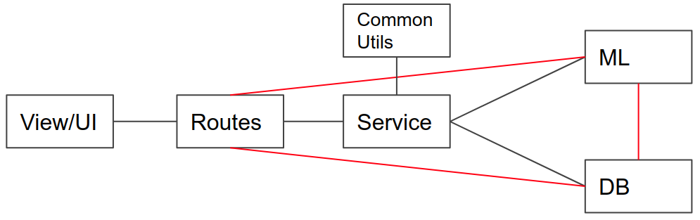

## Productionize-Flask application

##### Issues in simple flask development
1. All types of logic(db access, processing, ml logic) inside routes
2. No proper segregation of logics
3. Hard to debug
4. Hard to maintain in production environment

##### Solution : Follow MVC 

Here `red lines` means no direct communication between the layers.

In this series i will try to explain steps to productionize simple flask application with MVC architecture to separate logic between different layers. This helps to track issues and maintain code in production environment.

In this repo you can find a boiler plate code with proper layer segregation.

##### Step_1
very simple flask application

##### Step_2
flask application with database initialization and migration

##### Step_3
flask application with proper MVC architecture/layer separation

### Application Details
Step 3 is a simple application with 4 NLP apis.

1. Process text to get NER, POS and tokenization results. (**POST** `/api/process_doc`, api params: `text` & `task (ner, pos, tokens)`)
2. Get all results stored in database. (**GET** `/api/all_results`)
3. Get result by result id. (**GET** `/api/result/<id>`)
4. Delete any result by result id. (**DELETE** `/api/result/<id>`)

Things to learn/check:
1. How to use `yaml` for application configuration.
2. How to load ML models once rather then loading it again and again. 
3. Proper segregation of layers and logics.
4. Simple application level logging using `TimedRotatingFileHandler`.
5. Database (SQLite)

